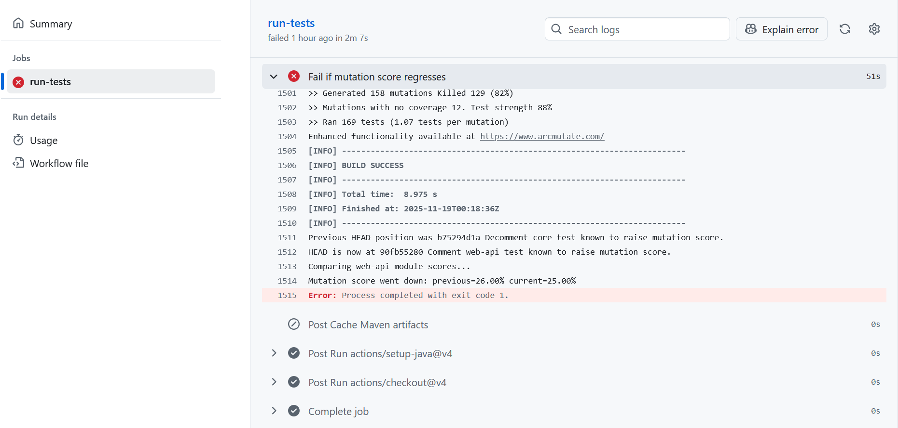

# Documentation tâche 3

## Contexte

Pour garantir que les contributions ne fassent pas régresser le score de mutation PIT, nous avons enrichi le workflow GitHub Actions `Run New Tests`. L’objectif est de comparer la couverture mutationnelle du commit courant avec celle du commit précédent et d’échouer la build si le score diminue.

## Choix d’implémentation

- **Scripts Python très simples** : les nouveaux scripts `.github/scripts/extract_mutation_score.py` et `.github/scripts/compare_mutation_scores.py` se limitent à la bibliothèque standard (`os`, `re`, `sys`). Ils contiennent des messages d’erreur explicites, un format d’appel minimal et aucune annotation avancée. Ce style volontairement simple rend le code plus accessible à un membre d’équipe peu expérimenté.
- **Comparaison séquentielle des commits** : le job exécute PIT sur le commit courant, puis fait un `git checkout` du commit précédent, relance PIT et revient au commit initial. Cette approche évite l’usage des worktrees ou d’astuces Bash moins familières et reste facile à suivre.
- **Tolérance aux premiers commits** : si l’historique ne contient pas de commit précédent, le script affiche un message et saute la comparaison pour ne pas bloquer une première contribution.
- **Seuil de comparaison** : la comparaison autorise une marge flottante minimale (`1e-6`) afin d’éviter les échecs causés par des arrondis.
- **Validation** : Pour valider que ces changements au workflow ont fonctionné, on a mis en commentaire des tests de la tâche 2 documentés à faire augmenter le score de mutation. On a confirmé qu'un tel changement cause un échec de workflow lors d'un push, et ce, pour chaque module modifié lors de la tâche 2 (`core` et `web-api`). Après avoir réinclut ces tests en les décommentant, le workflow du prochain push ne lance pas d'erreur comme attendu. De plus, les scripts imprime des messages indiquant le score de mutation pour le commit précédent et courant pour chacun des modules. Ces scores ont été comparés avec les vrais scores indiqués dans les rapports générés par pitest à chaque changement pour valider la cohérence.
### Exemple d'échec du workflow:
Lien au commit associé: https://github.com/charliepain/graphhopper/commit/90fb55280b0e791461d04b2dcf6dc62ae78f7870  
Lien au workflow : https://github.com/charliepain/graphhopper/actions/runs/19485028991/job/55765315230


## Documentation des tests avec mocks (RoundTripRoutingMockTest)

### Choix des classes testées

**Classe testée : `RoundTripRouting`**

La classe `RoundTripRouting` a été choisie pour les tests avec mocks pour les raisons suivantes :

1. **Dépendances multiples** : `RoundTripRouting` utilise plusieurs dépendances de GraphHopper (`LocationIndex` et `EdgeFilter`) qui nécessitent un graphe réel pour fonctionner. Ces dépendances sont complexes à configurer pour les tests.

2. **Méthodes à tester** : La méthode `lookup()` est une opération importante pour le calcul de routes en boucle. Elle mérite une validation rigoureuse.

3. **Besoin de tests isolés** : Les tests existants nécessitent souvent un graphe réel. Les tests avec mocks permettent de tester la logique de `RoundTripRouting` sans infrastructure de graphe complexe.

4. **Couverture de mutation** : Les mocks permettent de tester des scénarios spécifiques (points valides, points invalides) de manière reproductible, améliorant la couverture de mutation.

### Choix des classes simulées

**Classes simulées : `LocationIndex` et `EdgeFilter` (2 classes GraphHopper)**

Deux classes de GraphHopper sont mockées dans `RoundTripRoutingMockTest` :

1. **`LocationIndex`** (interface `com.graphhopper.storage.index.LocationIndex`) - Choisie pour être simulée pour les raisons suivantes :
   - **Complexité de configuration** : `LocationIndex` nécessite un graphe réel et un index préparé, ce qui est complexe à mettre en place pour les tests
   - **Dépendance externe** : C'est une dépendance externe au code métier de `RoundTripRouting`. Selon les principes de test unitaire, les dépendances externes doivent être isolées
   - **Contrôle des réponses** : Mockito permet de contrôler exactement quels `Snap` sont retournés par `findClosest()`, permettant de tester différents scénarios (points valides, points invalides)

2. **`EdgeFilter`** (interface `com.graphhopper.routing.util.EdgeFilter`) - Choisie pour être simulée pour les raisons suivantes :
   - **Interface GraphHopper** : C'est une interface de GraphHopper qui contrôle quelles arêtes sont acceptées lors de la recherche
   - **Flexibilité de test** : Mocking permet de tester différents scénarios de filtrage sans créer de vrais filtres
   - **Simplicité** : Interface simple avec une seule méthode `accept()`, facile à mocker

### Définition des mocks

**Configuration des mocks :**

```java
@ExtendWith(MockitoExtension.class)
public class RoundTripRoutingMockTest {
    @Mock
    private LocationIndex mockLocationIndex;  // Classe GraphHopper mockée #1
    
    @Mock
    private EdgeFilter mockEdgeFilter;        // Classe GraphHopper mockée #2
}
```

**Justification de la configuration :**

1. **Annotation `@ExtendWith(MockitoExtension.class)`** : Cette annotation active l'intégration de Mockito avec JUnit 5, permettant l'injection automatique des mocks annotés avec `@Mock`.

2. **Annotation `@Mock`** : Cette annotation crée automatiquement un mock de l'interface. Le mock est créé avant chaque test et réinitialisé, garantissant l'isolation entre les tests.

3. **Avantages de cette approche** :
   - **Simplicité** : Pas besoin de créer manuellement les mocks avec `Mockito.mock()`
   - **Lisibilité** : L'intention est claire grâce à l'annotation
   - **Maintenance** : Si les signatures changent, Mockito détectera les problèmes au moment de la compilation

**Configuration des comportements des mocks :**

Dans les tests, le comportement des mocks est défini avec `when().thenReturn()` :

```java
// Mock LocationIndex (classe GraphHopper mockée #1)
when(mockLocationIndex.findClosest(eq(lat), eq(lon), eq(mockEdgeFilter)))
    .thenReturn(snap);

// Mock EdgeFilter (classe GraphHopper mockée #2)
when(mockEdgeFilter.accept(any())).thenReturn(true);
```

### Choix des valeurs simulées

#### Test `testLookupWithMockedLocationIndexAndEdgeFilter()`

**Valeurs choisies :** 
- **LocationIndex** : Retourne des `Snap` valides avec des nœuds 100, 101, 102
- **EdgeFilter** : Accepte toutes les arêtes (`accept()` retourne `true`)

**Justification :**

1. **Analyse de la méthode `lookup`** :
   - `RoundTripRouting.lookup()` appelle `locationIndex.findClosest()` pour trouver le point de départ
   - Puis génère des points intermédiaires et les recherche également via `locationIndex.findClosest()`
   - `edgeFilter` est passé à chaque appel de `findClosest()` pour filtrer les arêtes valides

2. **Couverture des cas** :
   - **Snap valides** : Les `Snap` retournés ont des nœuds valides (100, 101, 102), testant le cas normal
   - **EdgeFilter acceptant** : Le filtre accepte toutes les arêtes, testant le cas où toutes les arêtes sont accessibles
   - **Structure de résultat** : Le test vérifie que le résultat contient au moins le point de départ et de fin (round trip)

3. **Vérification** : Le test vérifie que `findClosest()` est appelé avec `verify(mockLocationIndex, atLeastOnce()).findClosest(...)`, validant que les deux mocks sont utilisés ensemble.

#### Test `testLookupWithInvalidSnapFromLocationIndex()`

**Valeurs choisies :**
- **LocationIndex** : Retourne un `Snap` invalide (nœud `INVALID_NODE`)
- **EdgeFilter** : Accepte toutes les arêtes

**Justification :**

1. **Test d'erreur** : Ce test vérifie le comportement quand `LocationIndex` ne trouve pas de point valide
   - Un `Snap` invalide est retourné (par défaut, `closestNode` est `INVALID_NODE`)
   - Le code doit lever une exception `PointNotFoundException`

2. **Couverture des cas d'erreur** :
   - Teste le chemin d'erreur dans `lookup()` quand le point de départ n'est pas valide
   - Démontre que les mocks permettent de tester des scénarios d'erreur difficiles à reproduire avec un graphe réel

3. **Vérification** : Le test vérifie qu'une exception est levée et que `LocationIndex` a bien été appelé, validant que les deux mocks sont utilisés même dans le cas d'erreur.
